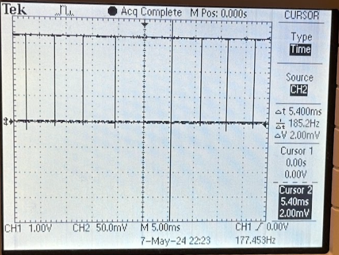
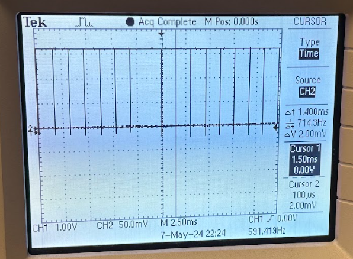

+++
title = "Hough Transform Line Detector - Documentation"
description = "The documentation of our Hough Transform project."
template = "prose.html"

url = "hough-transform-documentation/hough"
[extra]
lang = 'en'
math = true
mermaid = false
copy = true
comment = false
toc = true
+++

# Line detection via accelerated Hough Transform on an Terasic DE1-SoC

## Project Introduction

As part of our [ECE 5760](https://people.ece.cornell.edu/land/courses/ece5760/) final project, we accelerated line detection in a video 
input using an accelerated [Hough Transform](https://homepages.inf.ed.ac.uk/rbf/HIPR2/hough.htm).

We will focus on the workings of a Hough Transform that finds straight lines in an edge-detected input image.

At a high level, [line detecting] Hough Transforms track all possible lines that a given pixel may be a part of. Given an entire image,
the line that has the most contributions is determined to be a real line in the image.

In order to keep track of "all possible lines", a transformation is done from an input "image space" to a "Hough space."
We accelerated this transformation stage on our Altera FPGA, and left sorting and line drawing to be performed on our board's HPS.

## TODO: Add image/video?

<!-- https://www.youtube.com/watch?v=mXqz-rAfwIw -->

{{ webm(src="basic.webm", caption="Figure 1: Basic DLA (non-cyclic)", width=500) }}

The following details the design of our transformer, the testing and performance of our system,
and some takeaways from the project.

## High Level Design

### Rationale and Background

From our limited experience with computer vision algorithms, we were under the impression that many algorithms are both simple enough
and parallelizable enough to benefit from dedicated hardware acceleration.
As a simple example, algorithms such as edge detection that realy on convolutional kernels can be accelerated with dedicated hardware 
matrix multipliers.

With the notion that many CV algorithms could benefit from hardware acceleration, we explored a number of
interesting algorithms we could work on before settling our sites on implementing a General Hough Transformation for our final project.

[General Hough Transformations](https://www.cs.utexas.edu/~dana/HoughT.pdf), as it turns out, are quite hard to accelerate within 4 weeks. As a result, we pivoted our project to focus on a line-detecting Hough Transform.


#### Line Geometry

To understand Hough Transforms, one must first recall some things about lines.
Figure 2 shows a line with equation $y = -3x + 4$ over a domain of $0 \leq x \leq 3.$

The equation of this line tells us that for every amount we move in the $x$ direction, we will move $-3$ amounts in the $y$ direction.
This line is completely described by the coefficient of $x$, in this case $-3,$ and the offset amount $4.$
In fact, all lines can be described in this slope-intercept form. This is generally written as $y = mx + b$ where $m$
is the slope of our line and $b$ is the intercept of the line with the y-axis.


{{ figure(src="lines.png", caption="Figure 2: Line of equation y = -3x + 4 restricted to the domain of 0 <= x <= 3.", width=500, height=500) }}


We can also represent lines in a polar form. Instead of desrcibing a line with a slope $m$ and an intercept $b$,
we describe the line as function of the length of the normal to the line (from the origin) and the angle of this normal with respect
to the x-axis (ala unit circles). Zooming in on the same line as before, Figure 2 gives an example.

{{ figure(src="polar.png", caption="Figure 3: Normal and angle to line of equation y = -3x + 4.", width=500, height=500) }}

In this case our line could be described with a distance $\rho$ of $\sqrt{1.2^2 + 0.4^2} = 1.265$ and an angle $\theta$ of $1.25.$

It is with these polar representations that we will be working for our Hough Transform.

#### Hough Space

It is helpful to imagine a 2d space which can represent lines in polar representation. With $\rho$ on the x-axis and $\theta$ on the y-axis, any line can be represented as a single point in this "Hough Space."

#### Hough Transform Voting

Hough Transforms working by going through each pixel in a source image and counting up "contributions" or "votes" of said to pixel to a given line.
Consider that for a given point $(5,5)$ there can be infinitely many lines going through that point.
Figure 4 discretizes a few of these lines.

{{ figure(src="starburst.png", caption="Figure 4: Some of the lines going through point (5,5)", width=500, height=500) }}

A Hough Transformer keeps track of the contributions of all pixels in an input image. It does this by incrementing the values associated with lines that go through a given pixel upon encountering a pixel of interest (usually just a white pixel, as input images are post edge-dectection).

The contributions of a single pixel to our line hough space is shown in Figure 5.

{{ figure(src="point-hough-space.png", caption="Figure 5: Hough Space contributions of a single point.", width=500, height=500) }}


When taking the contributions of pixels compromising an entire line, the hough space will develop a single point that has a higher
value than any other point in the space. This point represent the $\rho$ and $\theta$ of the entire line in the source image.
Figures 6 shows our input image with a line at $y=50$ and Figure 7 shows the corresponding Hough space.

{{ figure(src="line-input.png", caption="Figure 6: Input image to a Hough transformer with a line y=50. Note that positive y is down.", width=500, height=500) }}

{{ figure(src="line-hough-space.png", caption="Figure 7: The Hough space corresponding to a line y=50. The point near the center corresponds with an angle of 180 degrees and a (normalized) distance of 610 (elaborated on in the implementation section).", width=500, height=500) }}

In this way, a Hough Transformer can traverse over every pixel in an edge-detected input image and create local maxima in Hough Space that correspond with lines in the input image.

It is then possible to find these local maxima via brute-force neighbor checking, and sort these points based on the number of votes 
they have. If we sort through $n$ lines, we can extract the $n$ most-liniest-lines out of our Hough Space.


#### High level Hough Transform

We elaborate on each of these steps in the further below, our  Hough Transform can be broken up into the following steps at a high level:

1. Traverse through input image and accumulate votes in the Hough Space.
2. Find local maxima via an immediate-neighbor comparison algorithm.
3. Sort the detected lines by number of votes.
4. Extract 2 points representing said lines.
5. Draw lines based on said 2 points.

Initially, data was taken from the FPGA and all of the steps above were performed on the HPS before being transferred back to the FPGA
in order to be displayed on a VGA system.

### Hardware/Software Tradeoffs

Considering the high level steps described above, it seems like a number of steps could be the target of our acceleration efforts.
Preliminary testing indicated that step 1 took the longest amount of time out of all steps, ranging anywhere between ~45% and ~80%
of the entire computation time.

Furthermore, we aimed to minimize the amount of data transfered over Altera's Avalon Bus IP from the FPGA to the HPS, as having 
multiple transfers saturated the bandwidth of the bus and led to glitches.

These points combined made step 1 a very appealing target for our acceleration efforts as it minimized the number of data transfers
required for our Hough Transform.

Accumulating our Hough Space on the FPGA required a large amount of memory. Using the FPGAs on-chip SRAM as our memory store due to ease of interfacing, we found ourselves needing to
reduce the resolution of our Hough Space in order to have our hardware design compile.
The HPS was more than capable of using a full-resolution Hough Space for calculations, at the expense of real-time computational speed.

Another issue that arose from using SRAM was the rigid interface we had due to using QSYS SRAM IP. Elaborated on in the hardware section, we had to double our accumulator's latency because only a single SRAM port was exposed to us in Verilog.


### Existing Patents, Copyrights, and Trademarks
We relied heavily on Altera IP to enable our Video-In hardware, as well as edge detection capabilities. Any applicable trademarks
to those properties are maintained.
We've sourced all online coding resources that inspired us/were used for reference. Much of this work was enabled by some of Bruce Land's
[documentation](https://people.ece.cornell.edu/land/courses/ece5760/), and Hunter Adam's [VGA Driver](https://vanhunteradams.com/DE1/VGA_Driver/Driver.html) without both of these
this project would have been out of scope for the 5 weeks we had to complete it. 

## Design


### Hardware

We relied on a number of peripherals on the DE1-SoC. Among them, a
[video-in ADC (section 4.3)](https://ftp.intel.com/Public/Pub/fpgaup/pub/Intel_Material/18.1/Computer_Systems/DE1-SoC/DE1-SoC_Computer_NiosII.pdf)
that supports an NTSC video source and outputs a 320x240
frame into the board's pixel buffer. A single bit enables edge detection, replacing raw input with edge detected image that displays
bright pixel at edges, and black elsewhere.

Our NTSC signal was obtained from a VideoSecu BC27B.

We used a serial connection to interface with the OS of our board (linux installed on an SD card) via PuTTY.

We used the board's built-in VGA port, along with Hunter's VGA Driver, elaborated on below.

For debugging purposes we also used the board's built-in switches to change the behavior of our hardware while not having to recompile
changes to our verilog.


#### VGA Driver
This excerpt is taken from our [lab-1](https://vanhunteradams.com/DE1/Lorenz/Lorenz.html)
report and is included here for completeness.

Our VGA driver was directly taken from the VGA driver present on [Hunter’s website](https://vanhunteradams.com/DE1/VGA_Driver/Driver.html).
The VGA driver implements a state machine that takes in 8 bit color values and drives VGA signals on our DE1-SoC VGA port.

This driver draws a 640x480 image by directly manipulating `hsync` and `vsync` lines. In particular, the driver draws row by row, driving `hsync` high for 640 + 16 cycles, going low for 96 sync cycles, and going high for 48 back porch cycles. Similarly, the `vsync` signal is high for 480 of these hsync rows, plus 10 more, low for 2 sync lines, and high for 33 more lines as part of the back porch. At each clock cycle, the driver splices the 8-bit color input it received and drives out color signals accordingly. Some logic in the driver keeps track of current count within a given row/column, and some simple arithmetic/resetting to 0 implements the VGA specification as described above.

To interface with the outside world, the VGA driver outputs the next x and y values it is expecting to draw. In practice, this allowed us to stay in sync with the driver without having to manually sync up our state machine with it. 

As the VGA driver outputs a 640 by 480 image, we constrained our driver to output from different FPGA SRAMs depending
on the quadrant of the screen the VGA was currently drawing to. For example, the upper left quadrant output our edge-detected image, and
the bottom right quadrant drew our detected lines on top of that image.

Using a VGA driver implemented on hardware enabled us to manipulate our image on our FPGA and directly output said image. It also let usbe sure that we were not being bogged down by any overhead introduced from proprietary Qsys implementations/communication over the Avalon Bus.


#### Address Calculator
Our address calculator converts a given pixel and $\theta$ into an address in memory that corresponds with the unique
line that goes through that point and whose normal makes an angle of $\theta$ with the x-axis. In Figure 3 one can consider that
given $\theta = 1.25$ and a point $(1.2,0.4)$ the red line is the only line that can meet those constraints.

In order to increment the correct point in Hough space, the $\rho$ of said line needs to be calculated. This can be modeled simply enough as follows.
$$\rho = x * \cos(\theta) + y *\sin(\theta).$$

It should be mentioned that the multiplies above are performed in 11.7 fixed point to optimially utilizes our board's 18-bit multipliers.
To enable this, our $x$ and $y$ values are shifted left by 7 before being multiplied by an 11.7 representaiton of our co/sine values.

We can then consider that our memory starts addressing at 0, so we need to offset our $\rho$ from a range of $[280,-280]$ to $[0,560].$
$$\rho_{addr} = \rho + 280.$$

Finally, to calculate our address, we recall that to imagine a 2d Hough space with $\rho$ on the x-axis,
we want to increment our address by `RHO_COUNT` $\rho_{count}$ every time we increment $\theta.$

As such we have that our address is
$$addr = \theta_n * \rho_{count} + \rho_{addr}.$$

Due to the nature of our local maxima checks in software, the actual address calculation implemented in hardware looks like
$$addr = (\theta_n + 1) * (\rho_{count} + 2) + (\rho_{addr} + 1).$$

These tweaks allow for the local maxima finder to avoid bound checks, by making the usable space of our memory start at the first column and first row, as opposed to the zeroth.

Figure ?? shows an abstract schematic of our address calculator. In practice our calculator was implemented with 2 continuous assignments
and a sine and cosine look up table.


{{ figure(src="address-calc-diagram.png", caption="Figure ??: Schematic of our address calculator", width=500, height=500) }}


#### Accumulator

Our accumulator interfaces with a single SRAM, representing a 2-d Hough space and x and y data, along with some inputs for parameters 
used in the address calculation.
The entire module begins accumulating at the of the `reset` signal.

As shown in Figure ??, our accumulator takes a cycle to read the current value from our accumulator, writes this value incremented by 1
to the same address in the next cycle, then returns to the read cycle, having incremented an internal register
holding the current value of $\theta.$

{{ figure(src="accumulator-fsm.png", caption="Figure ??: The state diagram of our accumulator module.", width=500, height=500) }}

Our sine tables were constructed such that each address of the table corresponds to the value of the trigonometric function in degrees.
This allowed us to avoid representing our $\theta$ in a fixed point, and instead we simply stored the current degree of $\theta.$
Degree's increased resolution compared to radians allowed us to perform this simplificaiton without losing accuracy in our transformer.

When $\theta$ reaches 179 (degrees) and has finished writing, our accumulator transitions to its done state, where it stays until
being reset.


Figure 5 shows the contributions of a single pixel to a hough space. In the figure, the faint line seens corresponds to
the lines that may go through said pixel.

The contributions of an entire horizontal line, say that in Figure ??, can be seen in Figure ?? + 1

{{ figure(src="line-input.png", caption="Figure ??: The input of an entire line to our accumulator. This would
take multiple go-done rounds to fully accumulate.", width=500, height=500) }}

{{ figure(src="line-hough-space.png", caption="Figure ??: The total accumulation of the input line in Figure ?? in our Hough space. Note there is a single point with a maximum value in the Hough space. This corresponds with the polar representation of our input line.", width=500, height=500) }}

The actual accumulator interface is shown below in Figure ??:

{{ figure(src="accumulator-interface.png", caption="Figure ??: The interface of our accumulator module.", width=500, height=500) }}

With our accumulator in place, we needed a dispatcher to traverse over our edge detected image and tell the accumulator when to accumulate for a given pixel.


#### Dispatcher
The accumulator expects x and y coordinates of the image whose pixel is not black. Therefore, we implemented a dispatcher that communicates with the accumulator to parse through the image. As shown in Figure ???, the dispatcher directly communicates with the SRAM holding the image pixel data from the video and the accumulator. At a very high level, the dispatcher takes in x and y coordinates of the image starting from the top right of the image, which is (0, 0), along with its corresponding pixel color. It performs a bitwise `AND` to determine whether the pixel is black, so `8’b000_000_00`, and outputs the x and y coordinates it received if the logic determines that the pixel is not black. Additionally, when it finds a pixel that is not black, it sends a go signal that tells the accumulator that it can start its computation. The `go` wire is directly connected to the `reset` wire of the accumulator, so the go signal actually simply resets the accumulator to pull it out of its own `done` state. 

{{ figure(src="dispatcher_block.png", caption="Figure ??: Dispatcher block diagram", width=500, height=500) }}

Figure ??? shows the FSM design that we used for the dispatcher. There are three stages: `INIT`, `READY`, `WAIT`. The `INIT` state serves as a reset state that only resets all the register values to 0. The `READY` state is where the dispatcher actually performs logic operations. It increments through the x and y coordinates to look at the next pixel, sends x and y coordinates to the SRAM and accumulator, and determines whether the pixel is a `valid_pixel` (meaning not zero). In the `WAIT` state, the dispatcher remains dormant because it is waiting for the accumulator to be done performing its computation. We do not want the dispatcher to keep going through pixels in the picture when the accumulator has not finished and is not ready to take in a new x and y coordinate pair. The dispatcher will leave the `WAIT` state when it receives a signal from the accumulator called the `acc_done` that tells the dispatcher that the accumulator has finished and it is ready to receive new x and y coordinates. 

{{ figure(src="dispatcher_fsm.png", caption="Figure ??: Dispatcher state machine", width=500, height=500) }}

In addition, the dispatcher receives a `wait_sig` from a PIO port that also tells the dispatcher to wait. This signal comes from the C program, and it is set high right before we reset all the accumulator values. After every time we go through the image, we want to zero out the accumulator values since the accumulator values are calculated for a single frame. Therefore, to prevent the dispatcher and accumulator from doing work while we are resetting all the accumulator values, we send out a `wait_sig` that stops all the entire hardware computation. 


#### Platform Designer
The Qsys layout’s most significant components are the Video-In Subsystem, the three On-Chip Memory blocks, and the one PIO port. The Video-In Subsystem consists of a series of Altera IP blocks connected to each other to process input data from the camera. In the Video-In Subsystem, there is a block of IP called the Edge Detection System, which allows us to obtain edge detection for “free”. In fact, if we had to instantiate an Edge Detection System on its own or implemented one in Verilog, it would have cost us more memory, which as we explain later was very limited. The Edge Detection IP takes streaming input data and sends streaming output data. The streaming interfaces on their own require additional IP blocks to wrap them in order to obtain the data as we intended. Luckily, the Video-In Subsystem already took care of this for us. In its core, the Edge Detection IP is a Sobel Filter, along with additional blocks that enhance the edge detection. 

{{ figure(src="edge_detection_ip.png", caption="Figure ??: Edge Detection IP Block from Altera Video IP Core", width=500, height=500) }}

Additionally, we instantiated three On-Chip Memory blocks on Qsys. The first memory block served the purpose of storing the data directly obtained from the Video-In Subsystem. Therefore, it contained data for a 320x240 picture (76,800 elements), where each pixel was 8 bits of data. The second memory block stored the accumulator data, which was around 102,000 elements of 8 bit data. The accumulator amount was represented in 8 bits and the memory was around 102,000 elements because it was 180 degrees x 560 rho values. The third memory block stored the lines that would be superimposed onto the original image, so it had the same dimensions as the first On-Chip Memory that contained the video data.

Lastly, we had the `wait_sig` PIO, which allowed the C program to momentarily pause all computation done by the Verilog. This helped to reset entire arrays of data without having to account for extra data being generated while the resetting was in progress. 

{{ figure(src="top_qsys.png", caption="", width=500, height=500) }}
{{ figure(src="bottom_qsys.png", caption="Figure ??: Qsys Layout of our Design", width=500, height=500) }}


#### System

Figure ??? shows the entire system at a very high level. For reference, blue is for any blocks instantiated in Qsys, orange is for blocks instantiated in Verilog, yellow is for logic done in the software, and green is the camera. The camera takes in data and directly stores each edge-detected frame into a dual ported SRAM. An M10k block implemented in Verilog reads from this SRAM and stores a copy of its data. The reason we added this M10k block to store a copy of the data was to be able to display the Qsys SRAM data onto the VGA driver. The Qsys SRAM can only be read or written from one address. Therefore, we were not able to both have the dispatcher and VGA driver read from the M10k at the same time for the x and y coordinates they both wanted. Basically, the VGA driver and the dispatcher requested different x and y coordinates at same times, so we needed a copy so that one reads from one and the other reads from the copy. Therefore, the dispatcher reads its desired x and y coordinates, along with its pixel color data, from the Video M10k. The accumulator communicates with the dispatcher to output its accumulation data into a Qsys SRAM called `acc_sram`. This SRAM is connected in Qsys to the HPS bus. This allows the C program to read and write the acc_sram by accessing the memory areas where the block is located. We want to write to the SRAM when we reset all the accumulator values once we move to the next frame. We want to read from the SRAM to perform the necessary remaining computations of the Line Hough Transform, which are finding the local maximum of the accumulator values, sorting through them, and drawing the lines. The C program then directly accesses another Qsys SRAM that is connected to the HPS bus and writes the lines to it. This is done, again, by writing to the specific memory locations where the SRAM is located in the bus. In the Verilog, we add the lines data with the original video data, which is located in the first Qsys SRAM we talked about called Video In SRAM. The VGA driver reads this and outputs it to the VGA screen. 

{{ figure(src="hough_system.png", caption="Figure ??: High Level Diagram of Entire System", width=500, height=500) }}

The original idea was to display the original video input, the edge detected data, the hough space, and the line drawn original image in the four quadrants of the VGA screen. The main problem with this was that we were running out of memory. To have the VGA driver read this data, we needed it to be in a Verilog instantiated M10k block. As stated before, the Qsys memory blocks do not allow us to read and write from different addresses. These read/write wires were already occupied for the data flow required in the logic computation. Therefore, we would have needed to store a copy of the data stored in the Qsys SRAMs into M10k blocks and have the VGA driver read from these. The video related memory blocks had 76800(240x320) elements of 8 bits and the hough space data was stored in 204386 elements of 10 bits memory. Once we added up all the memory space we needed to achieve this four quadrant display and compared it to the available memory, we realized that this would be impossible. Therefore, to still prove correct functionality, we displayed the edge detected image and the edge detected + lines drawn image.

{{ figure(src="working_verilog.png", caption="Figure ??: VGA screen output", width=500, height=500) }}


### Software

The software component of our Hough Transformer consists of a ported version of the 
OpenCV standard Hough Lines [implementation](https://github.com/opencv/opencv/blob/4.x/modules/imgproc/src/hough.cpp#L110-L229).
A porting of related [drawing functions](https://github.com/opencv/opencv/blob/4.x/modules/imgproc/src/drawing.cpp#L263) was also required, as the Hough Lines implementation assumes appropriate functions exist.

At a high level, our software is responsible for traversing through our Hough Space via an Avalon Bus and finding local maxima in our Hough Space. These maxima are then sorted, and lines are drawn that correspond to said maxima. This image is then sent back to our FPGA
via the same Avalon Bus previously mentioned.

#### Porting Process

The porting process was somewhat involved, as the OpenCV implementation relies on many OpenCV primitive and library functions
that we hoped to avoid relying on in our [code](../code). We were both hesitant to attempt installing such a large library on our DE1-SoC and
also hoped to gain a deeper understanding of the Hough Transformation algorithm through the porting process.

Porting the Hough transformation largely consisted of removing branches in function calls that dealt with representations we weren't
interested in (say, packed polar line representation) and simplifying special OpenCV specific function calls and types into simpler versions. For example, `cvRound()` was replaced with the `math.h` `round()` function, and `Vec2f` vectors, which hold 2 floats, were converted into `stlib` `vector`s holding a simple struct of 2 floats.

A line drawing method was ported that took in 2 points an drew a straight line between them in a `char` array. In order to interface
with our polar line representation, 
a function was made from scratch that converted the polar representation of a line into 2 distinct points describing
the bound of our line within our src image (for example, a horizontal line of $y=50$ would be represented by $(0,50)$ and $(319,50)$
as these fit within the bounds of our 320 x 240 source image).

Finally, some `C++` intricacies requires us to modify the assignment of some elemnents into arrays. In particular, using `assign()`
on some of the converted `std::vector`s did not deep copy the elements passed in, and use of an `=` assignment was necesarry to overcome 
this limitation.


#### Hough Space Traversal

Having exported one port of our Hough space SRAM to the HPS in Qsys, we were able to traverse through our Hough space simply by initializing a `char` pointer to the memory address dictated by Qsys and performing pointer arithmetic in order to access
our 8-bit accumulation values.

The pointer arithmetic corresponds with the shape of our accumulator SRAM, and loads the values on our SRAM into memory
accesible by our HPS.

```C
		for(theta_n = 0; theta_n < 180; ++theta_n){
			for(rho_n = 0; rho_n < rho_count; ++ rho_n ){
				accum_val = (char*)(hps_copy_sram2_ptr + ((theta_n + 1) * (rho_count + 2)) + (rho_n + 1));
				accum[((theta_n + 1) * (rho_count + 2)) + (	rho_n + 1)] = *accum_val;
			}
		}
```

`accum` is then passed into a function that finds local maxima within the array (by performing a naive neighbor check).
These maxima (and their values) are sorted via `std::sort`, and the 10 highest points are written to a `lines` vector.

#### Line drawing
At this point, polar line representation is converted into two points as described above, and lines are drawn onto a 320 x 240 (flattened) `char` array by traversing through the locations of all pixels between the two points and writing red values to those locations.

The contents of this `char` array is then written to our hardware SRAMs, again via memory mapping.

At this point, we an SRAM containing our source image accessible in hardware, along with an SRAM containing all zeroes, except
for pixels on lines found in our original source image.
Our VGA driver combines these 2 values (performing a simple sum) before displaying them on our screen. (Figure ??).

At this point we have succesfully found lines on a source image using a Hough Transform!!


The design and build process spanned approximately 4 weeks, and we encountered a number of challenges throughout this time.
We detail below some of these challenges how we overcame them,
and any takeaways we have.

### Testing Strategy
There are a few ways we ensure correctness of our system. The way we designed our design was from the bottom up. That is, we focused on the smaller individual blocks, whether it be in the hardware or software. For example, we implemented the memory blocks, the dispatcher, and the accumulator separately. On the software side, we ported the entire OpenCV Line Hough Transform implementation, but we did so module by module. At each of these steps, we tested. This means that we tested each block in isolation to ensure that the building blocks were correct. 

Each of the hardware blocks that we implemented were tested through ModelSim. Mainly, we created testbenches for the dispatcher and the accumulator and ran them through ModelSim by feeding specific data. This allowed us to have more control over what inputs the blocks were getting, more specifics on how the logic flowed through the waveforms, and clearer proof that the modules were working as intended. Additionally, for the accumulator, we built a Python model that we would feed the same values as the ModelSim testbench. Then, we compared the output of the Python model and the Verilog model and ensured that the outputs were the same (or close enough that it didn’t cause different behavior). 

We used the serial terminal to debug the C program. There were three main bugs that appeared in the software side: segmentation fault, incorrect line drawing, and incorrect line generation. All of these issues were debugged by printing to the serial interface. The segmentation faults were caused by memory mapping issues: when we were trying to address or allocate memory that was not available to us. This was usually due to mistakes on our part on the memory addressing or due to incorrect memory constants like the base and span. We brute forced the testing for this by printing between each memory mapping and found exactly where the program reached the segmentation fault. Then, we dug deeper to find out what was the problem. As described before, we used a line drawing function that took two points. However, generating the correct two points took longer than expected. This was because it was difficult to map the points we were expecting to see to the visual we were seeing on the VGA screen. We decided to use the serial terminal and we printed all the points generated, the points it chose, and the line that was drawn. We compared these values to the lines we were seeing on the VGA screen to determine whether the problem was originating in the coordinate generation function or somewhere else in the system. Luckily, we determined that the error was in the coordinate generation function because the points the program was choosing were out of the image, so the lines seemed to wrap around. Additionally, we observed interesting (but annoying) behavior in the C++ implementation of the OpenCV Hough Transform where the program was not assigning values to a vector as we were hoping. Instead of using the `assign` method, which was not assigning any value, we directly changed the value by looking at the specific element using `lines[i]`. This could have been caused by a change made in the porting process, a compiler difference, or some other mistake we made along the way. However, the important thing is that we were able to catch this issue by printing many variables before and after they were supposed to change and fixed the logic if they were not changing. 

Testing module by module gave us more confidence that when putting all these blocks together, the only bugs would be due to the way the modules are connected. Once we put it all together, the main method of testing was through visual observation. We tested by directing the camera towards different images like clear shapes, many wires that had no clear lines, or empty space. We will explain the steps we took to observe and measure the performance of our entire Line Hough Transform in the following section. 

### Challenges of Note

#### Structural Connections

One of the most mechanical, and arguably simple, part of our project also ate up the bulk of our time.
Keeping all of the structural connections in our Verilog correct proved harder than we imagined, and bugs with our
wiring led to hours of delays. It seems like this time sink resulted from a mixture of poor naming discipline
and long compilation times in particular. Multiple time we encountered issues where compilation began, (breaking) changes
were made in our Verilog, and when compilation finished and things worked, we would forget to revert to the compiled source code.
Additionally, long names such as `onchip_camera_in_to_onchip_copy_0_s2_address` and `hps_to_onchip_sram_s2_address`, both connected
to 2 different SRAMs, made keep track of modules and wires difficult.

A more disciplined approach to both naming and version tracking would probably help alleviate some of these issues.

#### Porting to `C++`

Porting the OpenCV functions we needed took longer than we expected, both because we underestimated the amount of methods we would need
to port, and because `C++` can behave peculiarly in certain cases. Mentioned above, one bug saw `=` assign a deep copy, while `assign()`
did not. We suspect certain macros/flags in OpenCV allow `assign()` to work properly within the library, while requiring us to use `=`
when those flags aren't present.

Additionally, some of the optimizations OpenCV performs are hard to parse at first glance, and are not well commented.
For example, to speed up local maxima checking, no bound checks are performed. To enable this, any 2d space (say our image) has rows/
columns added at the edges of the space. So a 3x3 image is converted into a 5x5 matrix, with the image data being stored in the 3 x 3 
center pixelsof the 5 x 5 image. This allows for neighbors of the physical point $(1,1)$ to be checked, as $(0,1)$ and $(1,0)$ are
guaranteed to be in bounds.

#### Validation of Sub-Blocks
The Hough Transforms computations are fairly involed and require nimbly navigating a range of binary representations over different spaces. This made it difficult to validate each sub-block in a timely manner. For instance, it was only by considerable effort on Nate's part that we were able to validate our compute block, requiring that he implement a Python version of the Hough Transform, run it on a simple image, pass that into a Python accumulator, and extract the results. The 2D input then had to be converted into our fixed-point binary representation (11.7, not standard), passed into a Verilog testbench, extracted (another 2D output), again converted from our representation, and passed into Python.

Issues like this arose for essentially all of our sub-blocks, and in some sense simply come with the territory. However, an effort might have been made ahead of time to explicitly map out the units, dimmensions and representation of each step in the computation process to allow for better discretization of the design.


## Results

### Timing
We were able to demonstrate a visually noticable and quantifiable acceleration of the Hough Transform. We tested the speed of our accelertor on several images, with varying complexity. In general, the more edges in an image, the more points needed to be traversed in the acculumator and the longer it took.

We were able to acquire extemely precise timing data by breaking out our `done` flag to the PIO ports and using and oscilloscope to measure the period, shwon below for three test casesof varying complexity.

<center>

<!--  -->

| Image    | Scope   | 
| -------- | ------- |
|  |  |
|  |  |
| | |

Shown in order, image 1 contains some a scene with a single shifted rectangle, used as our "moderate complexity" case, image 2 shows a mess of cables, our "high complexity" case and image 3 is a blank sheet of paper, our "low complexity" case.

Shown below is the performance of both the software implementation and the hardware implementation, measured in compute time (per image) over each test case.


<center>


</center>

We can see a dramatic speed-up in the cmopute time, so much so that the hardware time almost needs a log scale to be seen. We can see the dramtic increase in accumulator time for complex images and be assured that we picked the right computation to port to hardware.


What's interesting is that both of the operations essentially scale with O(N), where N is the number of non-zero pixels in the image after edge detection and thresholding (a good proxy for "complexity"). Both the software and hardware sweep over a constant subset of angels in the Hough space for each non-zero point.

No class on hardware acceleration would be complete without highlighting the fact that big-O notation, while a useful tool for building intuition, doesn't tell the whole story. Implementation details can mean a world of difference, and in our case we see a worst-case (ie; Image 2) of 4 FPS vs 40 FPS! 

### Accuracy

There's two lenses through which our results' accuracy might be viewed, the precision (and accuracy) with which we compute the timing results and the accuracy with which our different implementations affect the Hough Transform.

Since we were able to directly measure the time it took to run our hardware implementation on a range of real images, we consider our data to be incredibly precise and accurate. For the software implementation, we used the on-board linux system's clock to measure the time before and after each block of code. This allowed for better granularity in the results (which was important for decided which aspects of the Hough Transform to port to hardware) at the expense of a bit of accuracy and precision.

For our software implementation, we were able to use 32-bit floats to represent the Hough Transform parameters, but, because of memory limitations in the FPGA, we were forced to store our accumulator with only a 16-bit representation of each rho and theta. This equates to a halving of the dimmensions of the Hough-space image, equivalent to halving the precision. Intuitively, this resulted in a noticable but dismissable difference in the angle and location of the drawn lines.

### Safety

We were not able to identify and safety concerns with our project. However, in order to validate our design, a number of images were printed and placed before the camera. Users should take care to exposure to paper-cuts are minimized by utilizing proper PPE (gloves, goggles and perhaps a hardhat).

### Usability
The nature of our project is inherently visual, meaning some consideration need be given for visually impaired users. However, given that our system would mostly likely see use as a sub-block in a larger automated system, we did not identify any particular issues with usability.


<!-- {{ figure(src="compute_chart.png", caption="Figure 2: Line of equation y = -3x + 4 restricted to the domain of 0 <= x <= 3.", width=500, height=500) }} -->

<!-- |Scope   Output          |  Image  |
:-------------------------:|:-------------------------:

<!-- |  -->
<!--  |  -->

</center>

<!-- TODO: Need to include the following 
1.any and all test data, scope traces, waveforms, etc
2.speed of execution (hesitation, filcker, interactiveness, concurrency)
3.accuracy (numeric, music frequencies, video signal timing, etc)
4.how you enforced safety in the design.
5.usability by you and other people -->

<!-- #### Safety (for reference but TODO: change)
There are no significant safety concerns. A minor concern could be that waving one's hand rapidly up and down
to alter the variance of z-acceleration could lead to someone getting smacked. Users should be aware their
surroundings before controlling the simulation. -->

<!-- #### Usability (for reference but TODO: change)
Our program requires users to be able to freely move their hands to use the motion controls. However there are serial based
workarounds for this. Unfortunately, the visual component of our simulation would not be very accessible for the visually impaired. -->


## Conclusion

<!-- TODO: need to include the following
1.Analyse your design in terms of how the results met your expectations. What might you do differently next time? -->
### Design


We were actually a bit worried that we wouldn't see much of an acceleration in the image processing and we pleasantly surprised by how much faster the hardware implementation was. Since our time complexity is essentially the same, and the FPGA clock is much slower than the HPS, we were worried we might actually just slow the processing down. However, we reaped several benefits from implementing it on the FPGA that we did not anticipate:

	1. Parallelization of the Canny Edge Detection

As mentioned above, we were very fortunate to be able to utilize the existing edge-detection IP to save a ton of time converting on the front end. Additionally, by directly sending this to the hardware implementation, we avoided serial address computation (saving us a few cycles per pixel).

	2. Parallelization of the image-space traversal

By separating the dispatcher and compute modules, we're able to skip over empty image-space pixels while the compute module traverses the hough-space. Additionally, since both representations are stored on the FPGA we're able to update the addresses in parallel and essentially traverse 2 pixels (one in hough-space and one in image-space) per cycle.

	3. Parallelization of the computation of rho
One of the most cycle-intensive computations is computing the rho from a given x, y, and theta, requiring multiple multiplications and adds, likely taking multiple cycles to compute a rho for each pixel. On the FPGA, this is easily parallelized and peformed in a single cycle.


Thus, in some sense, we did not parallelize the Hough Transform algorithm so much as we parallelized the computation of several steps in the algorithm.

In the end, it was incredibly satisfying to see our efforts result in a marked improvement in performance.


<!-- 2.How did your design conform to the applicable standards? -->
### Standards

We were able to leverage existing IP to allow our design to sit between a camera and VGA-display, seamlessly integrating with both, requiring some additional hardware resources and integration effort on each end to de-serialize and re-serialize our data, respectively. 

#### Intellectual Property
We were happy to leverage existin Altera and Bruce IP to implement a range of functions, including the edge-detection, the VGA interface and the camera interface. Compilation, netlisting, place-and-route and more were done using the intel's Quartus software. The software we used was entirely our own or open source (OpenCV and GCC).

Additional effort will have to be exerted to develop our own versions of this IP before we can launch our Hough-Transform-as-a-service (HTaaS) company.

## Appendix

### Permissions

#### Project Website
The group approves this report for inclusion on the course website.

#### Project Video
The group approves the video for inclusion on the course youtube channel.


### Tasks
The work was largely evenly split among team members, with slight focuses on certain.
The following is a non-exhaustive list of topics focused on.

**Nathaniel:** Compute module design and testing, conversion of OpenCV C to HPS implementation, git doctor

**Brandon:** Mathematical background, architecture and debugging, moral support

**Tomas:** Dispatcher implementation and testing, edge-detection implementation, QSYS wizardry

### References
[Altera Video IP Core](https://people.ece.cornell.edu/land/courses/ece5760/DE1_SOC/Video_core.pdf)

[ECE5760 DE1-SoC Example Projects](https://people.ece.cornell.edu/land/courses/ece5760/DE1_SOC/HPS_peripherials/Examples_version_18.html)

[OpenCV Hough Transform](https://github.com/egonSchiele/OpenCV/blob/master/modules/imgproc/src/hough.cpp)

[Sobel Edge Detection Project from ECE5760 SP23 (used for system structure inspiration)](https://people.ece.cornell.edu/land/courses/ece5760/FinalProjects/s2023/cp444_xz598/cp444_xz598/index.html)

### Code (TODO: need to write)

Code can be found [here](../code).

[normal distribution]: https://en.wikipedia.org/wiki/Normal_distribution
[lab 3]: https://vanhunteradams.com/Pico/Helicopter/Helicopter.html
